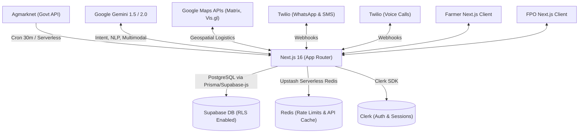

# AgriFlow: The Definitive Technical & Product Guide

AgriFlow is a robust, highly sophisticated agricultural intelligence platform engineered for the **Google Solution Challenge 2026**. It sits at the intersection of AI-driven conversational agents, real-time spatial geospatial mapping, and agricultural supply chain logistics. 

By aggressively targeting **SDG 2 (Zero Hunger)** and **SDG 12 (Responsible Consumption and Production)**, AgriFlow operates on a simple promise: eliminate post-harvest crop spoilage and stabilize volatile mandi prices by facilitating real-time digital handshakes between independent Farmers and bulk buyers (Farmer Producer Organizations - FPOs).

---

## 🧭 Table of Contents
1. [High-Level Architecture](#1-high-level-architecture)
2. [Database Schema & Data Models](#2-database-schema--data-models)
3. [The AI Omnichannel Engine](#3-the-ai-omnichannel-engine)
4. [Farmer Application Layer](#4-farmer-application-layer)
5. [FPO Application Layer & Geospatial Intelligence](#5-fpo-application-layer--geospatial-intelligence)
6. [Algorithmic Core (Spoilage & Prediction)](#6-algorithmic-core-spoilage--prediction)
7. [Comprehensive Project Structure](#7-comprehensive-project-structure)
8. [Environment Configurations](#8-environment-configurations)
9. [Local Development & Webhooks](#9-local-development--webhooks)

---

## 1. High-Level Architecture

AgriFlow is built on a serverless, edge-optimized stack.



### Tech Stack Drilldown
- **Core Framework**: Next.js 16, React 19, TypeScript (Strict Mode).
- **Styling Engine**: Tailwind CSS v4 alongside `shadcn/ui` primitives and Framer Motion.
- **Database**: Supabase PostgreSQL.
- **Caching**: Upstash Redis (used for rate-limiting webhooks and caching massive Agmarknet JSON payloads).
- **Authentication**: Clerk (with role-based access control and multi-factor capabilities).
- **AI Integration**: `@google/generative-ai` Native SDK.

---

## 2. Database Schema & Data Models

AgriFlow relies on 10 interconnected core domain tables housed within Supabase:

1. **`users`**: Extended profile data attached to Clerk IDs. Fields: `role` (farmer/fpo), `phone_number`, `preferred_language`, `district_id`.
2. **`districts`**: Geospatial master table. Fields: `name`, `state`, `lat`, `lng`.
3. **`crops`**: Master crop list. Fields: `id`, `name`, `baseline_shelf_life_days`, `decay_coefficient`.
4. **`listings`**: Active farmer crops for sale. Fields: `farmer_id`, `crop_id`, `quantity_quintals`, `quality_grade`, `expected_price`, `created_at`, `status` (active/sold).
5. **`inventory`**: FPO cold storage stock. Fields: `fpo_id`, `crop_id`, `quantity_quintals`, `harvest_date`, `location_id`.
6. **`matches`**: Digital handshakes. Fields: `listing_id`, `fpo_id`, `confidence_score`, `status` (pending/accepted/rejected).
7. **`daily_prices`**: Time-series table caching Agmarknet responses. Fields: `crop_id`, `district_id`, `date`, `min_price`, `max_price`, `modal_price`.
8. **`spoilage_logs`**: Time-series log tracking decay metrics for FPO dashboards.
9. **`alerts`**: Push notification and SMS history logs.
10. **`fpo_demands`**: Active FPO purchasing requirements. Fields: `fpo_id`, `crop_id`, `required_quantity`, `target_price`.

---

## 3. The AI Omnichannel Engine

AgriFlow is engineered for low-literacy users through its Twilio/Gemini integration. 

### WhatsApp Webhook Flow (`/api/whatsapp/webhook`)
1. **Payload Reception**: Twilio sends a POST request containing `Body` (text) or `MediaUrl0` (audio).
2. **Agentic Routing**: 
   - The backend passes the input to a Gemini Prompt tuned as an Intent Classifier.
   - It outputs a strictly typed JSON: `{ "intent": "ADD_LISTING" | "CHECK_PRICE" | "GENERAL_ADVICE", "entities": { ... } }`.
3. **Multimodal Audio Handling**: 
   - If audio is detected, `/lib/gemini-audio.ts` downloads the `.ogg` buffer.
   - Gemini 1.5 Flash natively digests the audio bytes (no separate speech-to-text layer needed) and translates it to English internally for data extraction.
4. **Action Execution**: Next.js interacts with Supabase based on the intent.
5. **Localized Response**: The response payload is generated by Gemini back into the user's `preferred_language` and fired off via Twilio SDK.

### The Automated Matchmaker (`/api/matches`)
When an FPO posts a demand, the Matchmaker script:
1. Runs a geospatial bounding-box query in Supabase.
2. Identifies matching `listings`.
3. Triggers an active outbound WhatsApp message to the farmer with interactive buttons: *"FPO Agritech wants 50qtl of Tomatoes at ₹1500. Accept?"*

---

## 4. Farmer Application Layer

The Farmer interface is built for high visibility and simple interactions.

- **`farmer-dashboard-client.tsx`**: The core shell. Mounts all sub-widgets based on URL search parameters (`?tab=inventory`).
- **`listing-manager.tsx`**: A strictly typed React Hook Form allowing farmers to upload available yields.
- **`best-time-to-sell.tsx`**: 
  - **Logic**: Reads the last 7 days of `daily_prices`. Passes vectors to Gemini.
  - **Output**: Generates a hold/sell recommendation along with an `ai-confidence-badge.tsx` (Explainable AI widget explaining *why* the suggestion was made).
- **`market-price-chart.tsx`**: Uses `recharts` to render a 14-day trailing moving average of local Mandi prices.
- **`my-earnings.tsx`**: Aggregates `matches` where status is 'accepted' to calculate expected payouts versus actual realized revenue.

---

## 5. FPO Application Layer & Geospatial Intelligence

The FPO (Buyer) side is heavily analytical and logistical.

- **`district-heatmap-google.tsx`**:
  - Uses `@vis.gl/react-google-maps`.
  - Aggregates active `listings` (Supply) and active `fpo_demands` (Demand) per district.
  - Calculates the Gap Delta. If Gap < 0 (Demand > Supply), the district renders Red. If Gap > 0, it renders Green.
- **`movement-recommendations.tsx`**:
  - Identifies adjacent districts (Green vs Red).
  - Pings the Google Maps Distance Matrix API.
  - Generates exact logistical routes (e.g., *"Move 200qtl from District A to District B. Est Transit: 4h 12m. Freight Cost Impact: Low."*)
- **`buyer-directory.tsx`**: A contact registry linking FPOs together to form B2B trading consortiums when bulk orders exceed a single FPO's capacity.

---

## 6. Algorithmic Core (Spoilage & Prediction)

### The Spoilage Engine (`cold-storage-board.tsx`)
This mathematical model prevents food waste. When inventory is logged, it evaluates:
$$ \text{Decay Rate} = \left( \frac{\text{Current Date} - \text{Harvest Date}}{\text{Baseline Shelf Life}} \right) \times \text{Crop Decay Coefficient} $$
- If `Decay Rate` > 0.75, the UI flashes red, and an SMS alert is fired to the FPO manager to dispatch immediately.
- Tomatoes have a high decay coefficient (e.g., 1.5), whereas Onions have a low one (e.g., 0.3).

### Data Freshness & Caching
Agmarknet API requests are heavy. To prevent 429 Rate Limits:
- `fetch-prices` Cron job pulls bulk data.
- Stores localized district slices in **Upstash Redis** (`SETEX district:5:prices 1800 payload`).
- The `data-freshness-badge.tsx` reads the Redis TTL and displays *"Updated 12 mins ago"*.

---

## 7. Comprehensive Project Structure

```text
agriflow/
├── package.json                   # React 19, Next 16, Tailwind v4
├── .env.local                     # Core Secrets
├── src/
│   ├── app/                       # Next.js App Router
│   │   ├── api/                   # Serverless APIs
│   │   │   ├── cron/fetch-prices/ # Vercel Cron handler for Agmarknet
│   │   │   ├── health/            # Prometheus/Datadog scraping endpoint
│   │   │   ├── inventory/         # FPO Inventory CRUD routes
│   │   │   ├── listings/          # Farmer Listing CRUD routes
│   │   │   ├── matches/           # Matchmaker execution scripts
│   │   │   ├── prices/            # Redis-backed GET routes for UI charts
│   │   │   ├── sms/               # Twilio Outbound SMS executor
│   │   │   ├── voice/webhook/     # Inbound Twilio TwiML Voice handler
│   │   │   └── whatsapp/webhook/  # Inbound Twilio Messaging handler
│   │   ├── dashboard/             # Private Farmer Routes (Clerk Protected)
│   │   ├── fpos/                  # Private FPO Routes (Clerk Protected)
│   │   ├── register/              # Role Assignment UI
│   │   └── sign-in/               # Clerk Pre-built UI
│   ├── components/
│   │   ├── dashboard/             # Domain UI Blocks
│   │   │   ├── ai-confidence-badge.tsx    
│   │   │   ├── best-time-to-sell.tsx      
│   │   │   ├── cold-storage-board.tsx     
│   │   │   ├── district-heatmap.tsx       
│   │   │   ├── movement-recommendations.tsx
│   │   │   └── ... (20+ domain components)
│   │   ├── layout/                # Navbars, Sidebars (`dashboard-shell.tsx`)
│   │   ├── providers/             # React Context (`I18nProvider`, `ClerkProvider`)
│   │   └── ui/                    # shadcn/ui generic components
│   └── lib/                       # Business Logic
│       ├── agmarknet/             # Scraping/Parsing govt tables
│       ├── i18n/dictionaries.ts   # JSON trees for EN, HI, TE, KN
│       ├── supabase/client.ts     # Supabase instantiation
│       ├── twilio.ts              # Twilio SDK global instance
│       ├── gemini.ts              # Intent classification prompts
│       ├── gemini-audio.ts        # Audio buffer array processing
│       └── redis.ts               # Upstash client
└── supabase/
    └── migrations/                # SQL definitions for the 10 domain tables
```

---

## 8. Environment Configurations

To run the application, `.env.local` requires strict adherence to these variables:

| Variable | Purpose | Location |
|----------|---------|----------|
| `NEXT_PUBLIC_CLERK_PUBLISHABLE_KEY` | Frontend Auth | Clerk Dashboard |
| `CLERK_SECRET_KEY` | Backend Auth Verification | Clerk Dashboard |
| `NEXT_PUBLIC_SUPABASE_URL` | DB Connection String | Supabase Dashboard |
| `SUPABASE_SERVICE_ROLE_KEY` | DB Admin bypass for Webhooks | Supabase Dashboard |
| `NEXT_PUBLIC_GOOGLE_MAPS_API_KEY` | React Vis.gl Map rendering | Google Cloud Console |
| `GOOGLE_MAPS_SERVER_KEY` | Distance Matrix Logistics | Google Cloud Console |
| `GEMINI_API_KEY` | AI Prompting and Multimodal | Google AI Studio |
| `TWILIO_ACCOUNT_SID` | Communications Gateway | Twilio Console |
| `TWILIO_AUTH_TOKEN` | Communications Gateway | Twilio Console |
| `TWILIO_WHATSAPP_NUMBER` | The bot's active number | Twilio Console |
| `UPSTASH_REDIS_REST_URL` | Fast API Caching | Upstash Console |

---

## 9. Local Development & Webhooks

1. **Install and Run**:
```bash
npm install
npm run dev
```

2. **Exposing Webhooks**:
Because Twilio needs a public URL to POST data to when a farmer sends a WhatsApp message, you *must* use `ngrok`.
```bash
ngrok http 3000
```
Take the generated URL (e.g., `https://abc-123.ngrok.app`) and configure it in Twilio:
- **WhatsApp Sandbox**: Set incoming messages webhook to `https://abc-123.ngrok.app/api/whatsapp/webhook`
- **Voice Phone Number**: Set incoming call webhook to `https://abc-123.ngrok.app/api/voice/webhook`

3. **Running the Cron Jobs locally**:
Vercel handles cron jobs in production via `vercel.json`. Locally, you can manually trigger them:
```bash
curl "http://localhost:3000/api/cron/fetch-prices?mode=mock&historyDays=7"
```

### Production Deployment
The application is optimized for Vercel. Connect the GitHub repo to Vercel, populate the environment variables, and Next.js 16 will handle the automatic edge-caching and serverless function deployment. Supabase migrations should be pushed via the Supabase CLI before deploying the Vercel branch.
