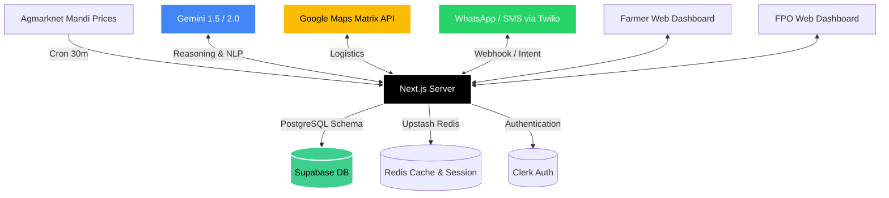

# AgriFlow

AgriFlow is a multilingual agricultural intelligence platform built for the Google Solution Challenge 2026. Designed to bridge the information and logistical gap between farmers and Farmer Producer Organizations (FPOs), AgriFlow combines live mandi prices, real-time spatial heatmaps, and a powerful AI-driven multilingual WhatsApp/Voice bot to stabilize market prices and drastically reduce post-harvest food waste.

**SDG 2** (Zero Hunger) & **SDG 12** (Responsible Consumption and Production)

---

## 📡 Live End-to-End Architecture



---

## 🧠 Comprehensive Feature List & Flows

### 1. User Onboarding & Identity Flow
- **Clerk Authentication**: Secure sign-up/sign-in via OTP or OAuth.
- **Role Selection**: During onboarding (`/register`), users split into two distinct tracks: **Farmer** or **FPO**.
- **Localization Preferences**: Users set their preferred language (English, Hindi, Telugu, Kannada) which governs both web UI strings (`/lib/i18n`) and outbound AI communication.

### 2. The Omnichannel Bot (WhatsApp, Voice & SMS)
Located primarily in `/api/whatsapp` and `/api/voice`, powered by `/lib/twilio.ts` and `/lib/gemini-audio.ts`.
- **Inbound Text (WhatsApp)**: 
  - Twilio POSTs to `/api/whatsapp/webhook`.
  - The Gemini Intent Classifier determines the user's need (e.g., *Check Prices*, *Add Listing*, *Ask Advice*).
  - The system queries Supabase/Redis and responds conversationally in the user's native language.
- **Inbound Audio (WhatsApp Voice Notes)**: 
  - The bot extracts the `.ogg` buffer from the Twilio Media URL.
  - Passed directly to `gemini-audio.ts` utilizing Gemini's multimodal capabilities to perform direct speech-to-text and translation simultaneously.
  - The bot replies with contextually accurate text or audio.
- **Twilio Voice Phone Calls**: 
  - Similar to voice notes, farmers call a Twilio number which records their query and pipes it to Gemini, returning a synthesized spoken TwiML response in their regional language.
- **SMS Fallback**: Triggered by critical alerts or cron jobs, sending standard SMS to feature phones.

### 3. Core Farmer Journey & Features
- **Listing Manager (`listing-manager.tsx`)**: Farmers post their harvested crops, specifying quantity (quintals), quality grade, and expected price. Data is written to Supabase `listings` table.
- **Best Time To Sell Predictor (`best-time-to-sell.tsx`)**: Uses predictive algorithms evaluating cached Agmarknet price trends against historical data vectors to explicitly advise farmers whether to *Hold* or *Sell*.
- **Live Market Price Chart (`market-price-chart.tsx`)**: Renders interactive graphs of local Mandi price fluctuations.
- **Earnings Tracker (`my-earnings.tsx`)**: Calculates historical accepted matches and computes projected payouts.
- **Alerts & Reports Panel**: A centralized inbox displaying SMS/WhatsApp notifications and weather warnings.

### 4. Core FPO Journey & Features
- **District Supply-Demand Heatmaps (`district-heatmap-google.tsx`)**: 
  - The crown jewel for FPOs. Aggregates all active farmer listings versus FPO demands.
  - Overlays a dynamic visual representation on Google Maps: Red zones indicate severe crop shortages, Green zones indicate high surplus.
- **Inventory & Bulk Manager (`inventory-manager.tsx`)**: Tracks current cold-storage stock, logged by harvest date and quality.
- **Spoilage Engine (`cold-storage-board.tsx`)**: 
  - An algorithmic matrix that monitors perishable goods in storage.
  - Computes degradation curves (e.g., Tomatoes decay faster than Onions) and flags inventory entering the "Red Zone" to prioritize emergency dispatch and eliminate waste.
- **Movement Recommendations Board (`movement-recommendations-board.tsx`)**: 
  - Uses the Google Maps Distance Matrix API.
  - Automatically recommends dispatching trucks from Surplus District A to Deficit District B, calculating exact transit times and logistical costs.
- **Buyer/FPO Directory Map (`fpo-directory-map.tsx`)**: Allows FPOs to see neighboring buyer networks for bulk B2B trading.

### 5. AI Agentic Matching Flow
- **The Matchmaker (`/api/matches`)**: 
  - FPOs register a demand requirement (e.g., "Need 50 quintals of Rice").
  - A background cron/trigger scans the `listings` table for local farmers matching that exact criteria.
  - If confidence > 80%, the bot proactively messages the Farmer via WhatsApp: *"FPO X is offering ₹2,100/qtl for your Rice. Reply YES to accept."*
  - Farmer replies "Yes", the webhook processes the intent, updates Supabase, and finalizes the digital handshake.

### 6. Automated Background Services (Cron)
- **Agmarknet Price Fetcher (`/api/cron/fetch-prices`)**: 
  - Runs continuously on a cron schedule (every 30 mins).
  - Parses live Mandi data via `agmarknet` lib.
  - Populates Upstash Redis ensuring the dashboard reads are lightning fast and immune to rate-limiting.
- **Daily Alerts Dispatcher**: Scans local weather anomalies and sudden price drops, issuing Twilio notifications.

---

## 📂 Exhaustive Project Structure

```text
agriflow/
├── package.json                   # Dependencies, Tailwind v4, React 19, Next 16
├── .env.local                     # Secrets: Clerk, Supabase, Twilio, Gemini, Google Maps
├── src/
│   ├── app/                       # Next.js App Router Pages & Layouts
│   │   ├── api/                   # Serverless Endpoints
│   │   │   ├── cron/              # fetch-prices logic
│   │   │   ├── demo/              # Mock generation scripts
│   │   │   ├── gaps/              # Supply/Demand algorithm computation
│   │   │   ├── health/            # Uptime diagnostics
│   │   │   ├── inventory/         # FPO Inventory CRUD
│   │   │   ├── listings/          # Farmer Listing CRUD
│   │   │   ├── matches/           # AI matching triggers & accept routes
│   │   │   ├── onboarding/        # User role setup endpoints
│   │   │   ├── prices/            # Redis-cached price fetchers
│   │   │   ├── recommendations/   # Google Maps routing algorithms
│   │   │   ├── sms/               # Outbound Twilio SMS triggers
│   │   │   ├── users/             # Profile management
│   │   │   ├── voice/             # Twilio Voice Call Webhooks
│   │   │   └── whatsapp/          # Twilio WhatsApp Inbound Webhooks
│   │   ├── dashboard/             # Farmer Dashboard Base Layout
│   │   ├── fpos/                  # FPO Dashboard Base Layout
│   │   ├── register/              # Role Selection views
│   │   ├── sign-in/               # Clerk Auth
│   │   └── sign-up/               # Clerk Auth
│   ├── components/                # Modular React Components
│   │   ├── dashboard/             
│   │   │   ├── ai-confidence-badge.tsx         # Explainability UI
│   │   │   ├── alerts-reports-panel.tsx        # Inbox UI
│   │   │   ├── best-time-to-sell.tsx           # Prediction UI
│   │   │   ├── buyer-directory.tsx             # FPO B2B UI
│   │   │   ├── cold-storage-board.tsx          # Spoilage Engine UI
│   │   │   ├── district-heatmap-google.tsx     # Google Maps Overlay UI
│   │   │   ├── farmer-dashboard-client.tsx     # Core Farmer Base
│   │   │   ├── fpo-dashboard-client.tsx        # Core FPO Base
│   │   │   ├── inventory-manager.tsx           # FPO Stock UI
│   │   │   ├── listing-manager.tsx             # Farmer Form UI
│   │   │   ├── market-price-chart.tsx          # Recharts Mandi Graphs
│   │   │   ├── movement-recommendations.tsx    # Logistics Routes UI
│   │   │   └── my-earnings.tsx                 # Payment Tracker
│   │   ├── layout/                # Shells (sidebar, header, mobile-nav)
│   │   ├── providers/             # i18n, Theme, Auth Context Wrappers
│   │   └── ui/                    # shadcn/ui library primitives
│   └── lib/                       # Domain Logic & Services
│       ├── agmarknet/             # Parsing logic for govt data
│       ├── i18n/                  # Dictionaries: EN, HI, TE, KN
│       ├── supabase/              # DB config and raw queries
│       ├── whatsapp/              # WhatsApp formatting logic
│       ├── gemini-audio.ts        # Multimodal speech-to-text bridge
│       ├── gemini.ts              # Core conversational prompt engineering
│       ├── redis.ts               # Upstash configuration
│       ├── twilio.ts              # Global Twilio client instance
│       └── regions-map.ts         # Lat/Lng geospatial constants
└── supabase/                      # PostgreSQL Schema Migrations
```

---

## 🛠 Tech Stack Details

- **Frontend Environment**: Next.js 16 (App Router), React 19, TypeScript
- **Styling & UI**: Tailwind CSS v4, shadcn/ui primitives, Framer Motion for micro-interactions
- **AI Brain**: `@google/generative-ai` (Gemini 2.5 Flash / Gemini 1.5 Pro)
- **Geospatial Processing**: `@vis.gl/react-google-maps`, Google Maps Distance Matrix API
- **Authentication**: Clerk (with localized components)
- **Database Layer**: Supabase (PostgreSQL with RLS)
- **Caching & Rate-limiting**: Upstash Redis Serverless
- **Omnichannel Communications**: Twilio API (WhatsApp Business API, Programmable Voice, Programmable SMS)

---

## 💻 Running Locally

1. **Install dependencies**:
```bash
npm install
```

2. **Environment Configuration**:
Copy `.env.example` to `.env.local` and provide standard keys:
- `NEXT_PUBLIC_CLERK_PUBLISHABLE_KEY` & `CLERK_SECRET_KEY`
- `NEXT_PUBLIC_SUPABASE_URL` & `SUPABASE_SERVICE_ROLE_KEY`
- `NEXT_PUBLIC_GOOGLE_MAPS_API_KEY`
- `GEMINI_API_KEY`
- `TWILIO_ACCOUNT_SID`, `TWILIO_AUTH_TOKEN`, `TWILIO_WHATSAPP_NUMBER`
- `UPSTASH_REDIS_REST_URL` & `UPSTASH_REDIS_REST_TOKEN`

3. **Start the server**:
```bash
npm run dev
```

4. **Webhooks Setup (Crucial for WhatsApp/Voice)**:
Use `ngrok` or `localtunnel` to tunnel your localhost:3000 port and point your Twilio Console to:
- `https://<YOUR_NGROK_URL>/api/whatsapp/webhook` (For WhatsApp Inbound)
- `https://<YOUR_NGROK_URL>/api/voice/webhook` (For Voice Call Inbound)

### Demo & Testing Endpoints
```text
GET  /api/health                                    # Health and metrics
GET  /api/cron/fetch-prices?mode=mock&historyDays=7 # Mock Agmarknet updates
POST /api/matches/simulate-accept                   # Demo the farmer 'YES' WhatsApp loop
```
